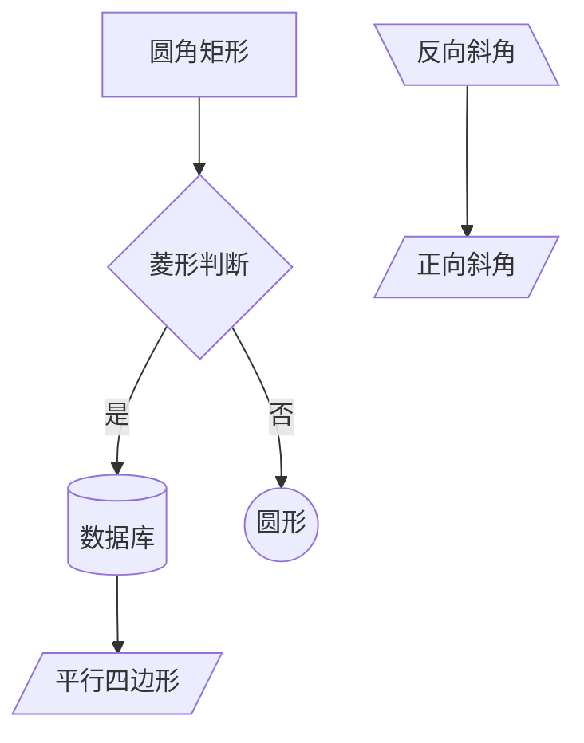
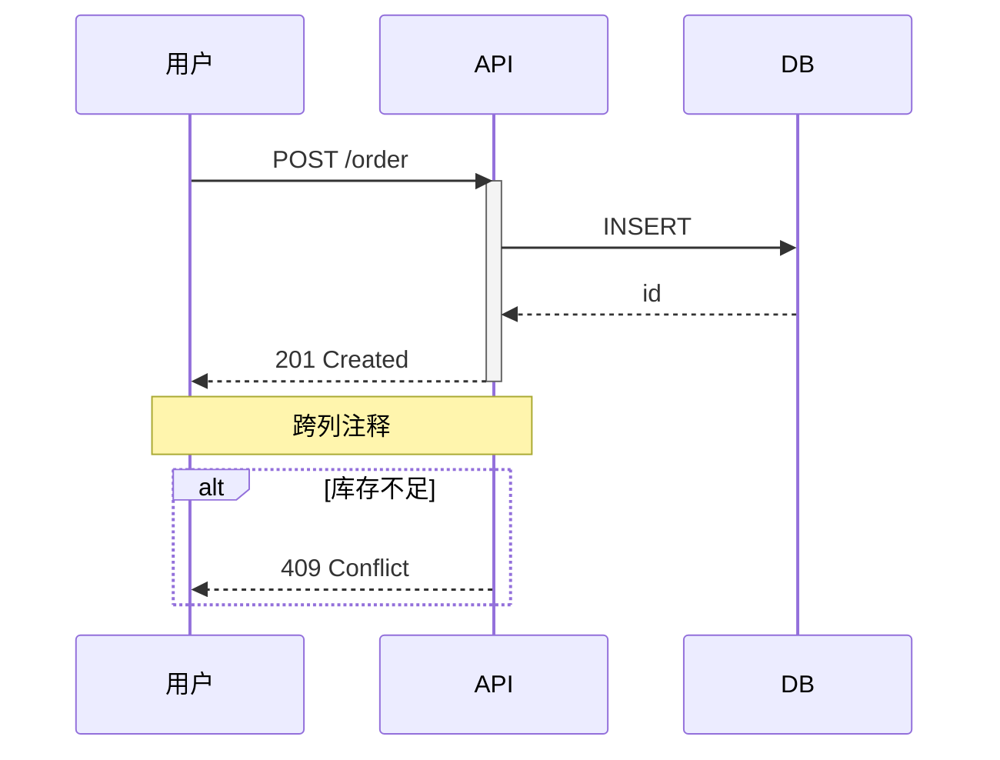
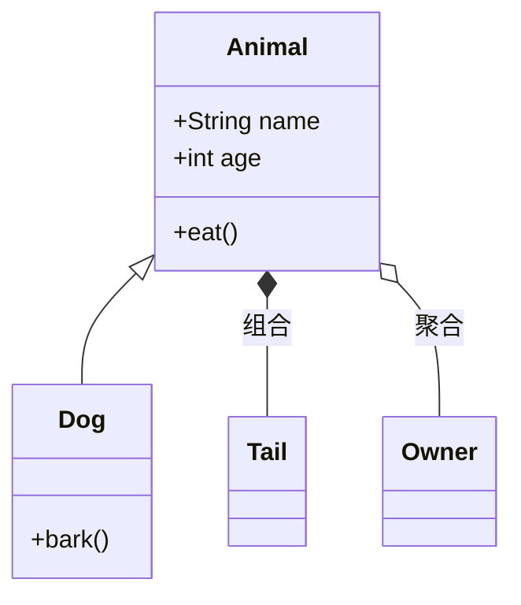
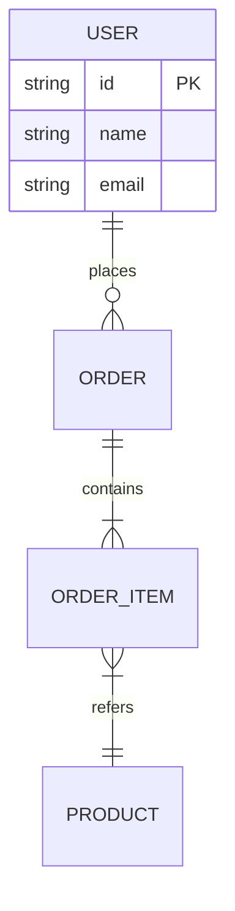
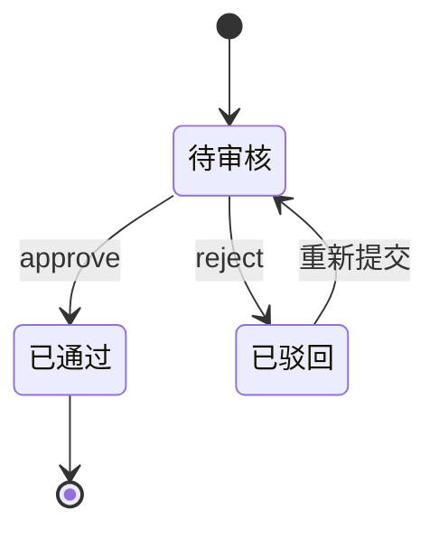
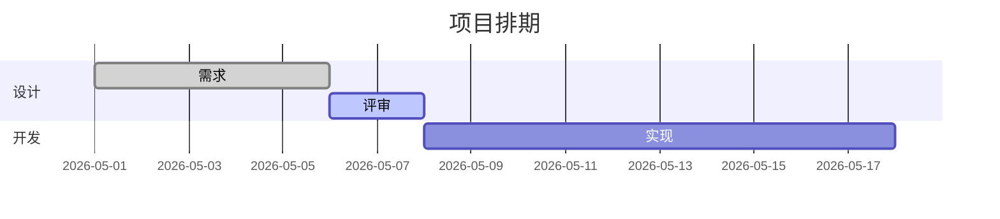
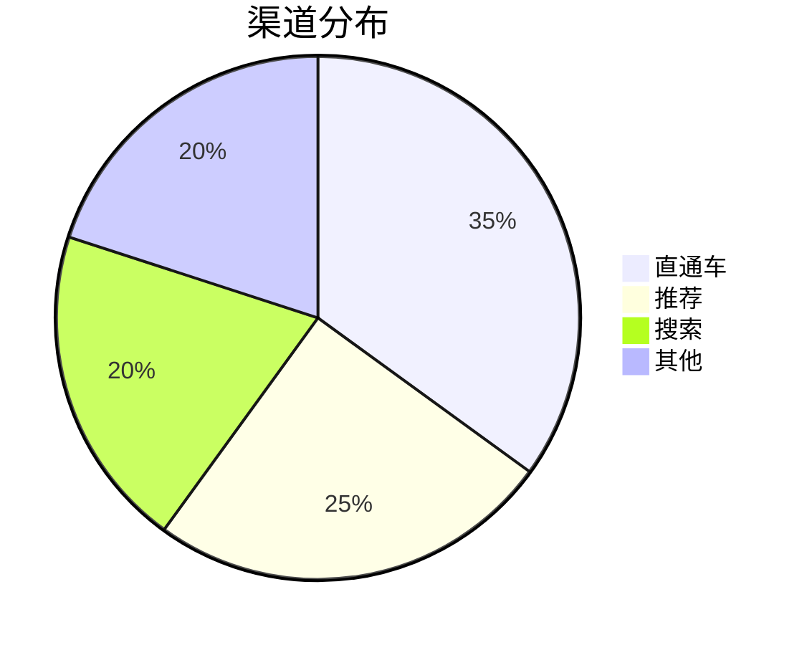
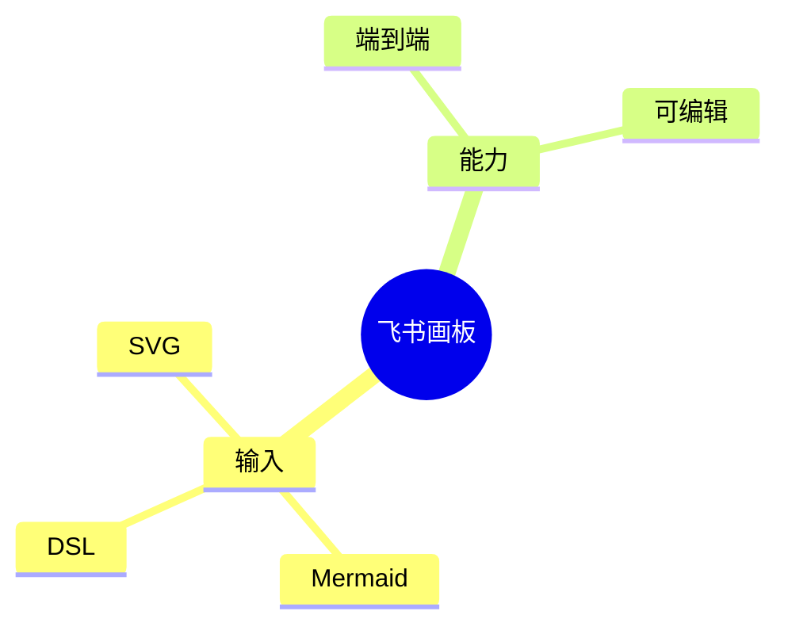
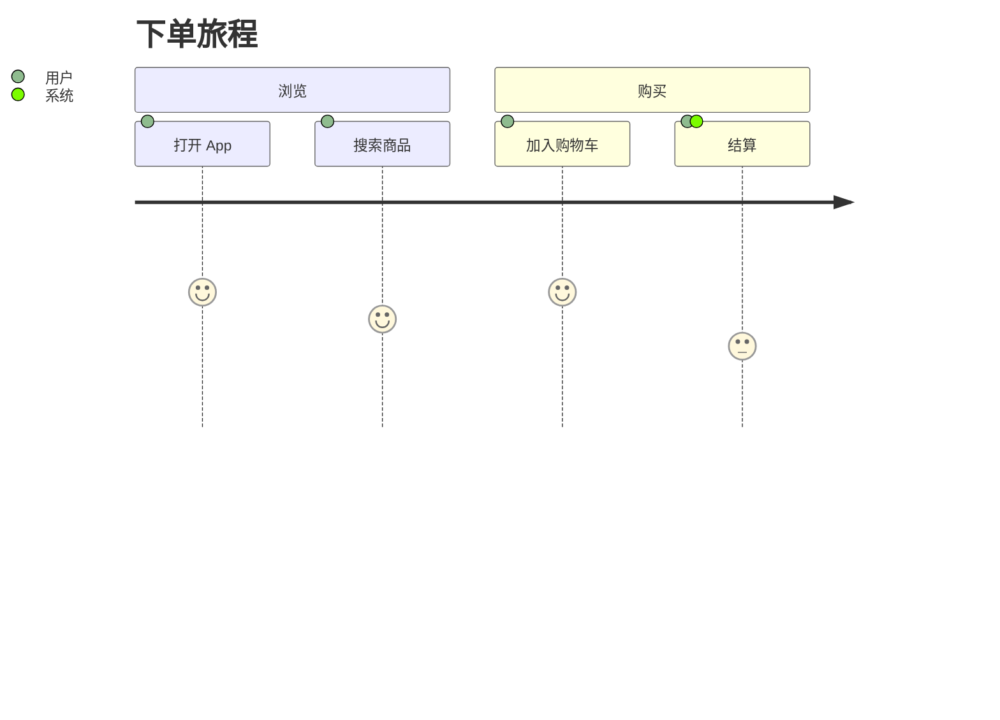
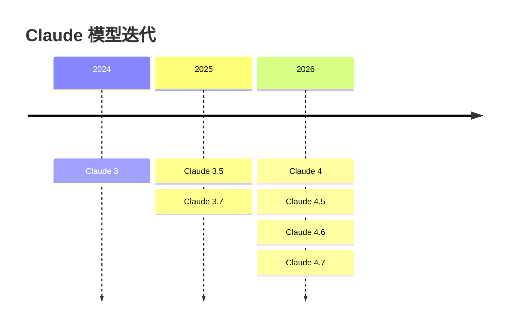

# Route: Mermaid

Mermaid 是**最省 token** 的方案——你只写几行声明式语法，`whiteboard-cli` 帮你自动布局 + 转成飞书画板节点。

## 何时用

| 选 Mermaid | 选 SVG/DSL |
|---|---|
| 流程图 / 时序图 / 类图 / 状态图 / ER / 甘特 / 思维导图 / 饼图 | 自由设计、海报、信息图、几何复杂 |
| 节点 < 50 | 大量自定义美学 |
| 内容大于美观 | 美观大于布局自动化 |
| 接口/系统类技术文档 | 业务汇报、品牌物料 |

## 调用

```bash
# 内联（短图）
feishu-lark call feishu_whiteboard '{
  "action": "draw",
  "doc_id": "<doc_url>",
  "from": "mermaid",
  "content": "flowchart TD\n  A --> B"
}'

# 落盘（长图，推荐）
cat > /tmp/wb-demo/seq.mmd <<'EOF'
sequenceDiagram
  participant U as User
  participant API
  U->>API: GET /thing
  API-->>U: 200
EOF

feishu-lark call feishu_whiteboard '{
  "action": "draw",
  "doc_id": "<doc_url>",
  "input_path": "/tmp/wb-demo/seq.mmd"
}'
```

## 各图谱语法

### flowchart / graph（流程图）



- 方向：`TD`(上下) / `LR`(左右) / `RL` / `BT`
- 形状：`[]`矩形 / `()`圆角 / `(())`圆 / `{}`菱形 / `[/...\]`梯形 / `[()]`圆柱 / `>...]`旗形
- 样式：
  ```mermaid
  classDef hot fill:#FEE3E2,stroke:#D25D5A,color:#1F2329
  class A,B hot
  ```

### sequenceDiagram（时序图）



- 箭头：`->` 实线无头 / `->>` 实线箭头 / `-->>` 虚线箭头（响应）/ `-x` 失败
- `activate`/`deactivate` 显示生命周期条
- `Note over A,B`：跨列注释
- `alt`/`else`/`opt`/`loop`/`par`：流程分支

### classDiagram



- 关系：`<|--`继承 / `*--`组合 / `o--`聚合 / `..>`依赖 / `<--`关联

### erDiagram



- 基数：`||`一 / `o|`零或一 / `|{`一或多 / `o{`零或多

### stateDiagram-v2



### gantt



### pie



### mindmap



### journey



### timeline



## 美化技巧

Mermaid 默认配色平凡。提升观感：

1. **加 `classDef` 用经典色板**（[`style.md`](style.md)）
   ```mermaid
   classDef pri fill:#F0F4FC,stroke:#5178C6,color:#1F2329
   class A,B pri
   ```
2. **关键节点用对比色**：起止节点用强调色（`#1F2329` 黑）
3. **分组用 `subgraph`** + 单独 classDef
4. **`linkStyle 0,1 stroke:#BBBFC4,stroke-width:2`** 弱化连线

## 限制

- **节点过密**：> 50 个节点时 dagre 布局会拥挤，考虑拆图或改 SVG 自由布局
- **不支持 flowchart-elk**：whiteboard-cli 默认 dagre，不要混用 elk 实验布局
- **gitGraph**：解析正常但样式简单
- **xychart-beta / requirementDiagram**：稳定性差，建议绕开
- **超长 label 文字溢出**：手动换行 `<br/>` 或缩短

## 检查清单

- [ ] 选对图谱类型（flowchart vs sequenceDiagram 等）
- [ ] 节点 ≤ 50（否则拆图）
- [ ] 中文 label 用 `"..."` 包裹（含空格/中文标点必加）
- [ ] 关键节点上了 classDef 强调色
- [ ] 用 `--check` 检查无 text-overflow
